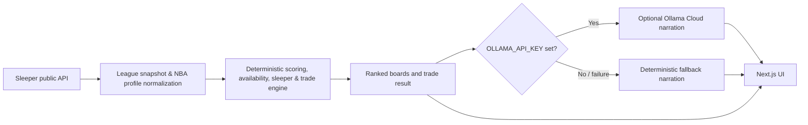

# CourtIQ

**League-specific NBA fantasy analysis from a public Sleeper league—deterministic scoring first, optional Ollama Cloud narration second.**

CourtIQ exists because a generic player list cannot answer a league-specific question: does this available player help under *this* league's scoring? CourtIQ imports a public Sleeper NBA league, interprets the supported scoring setup, removes players already rostered in that league, and produces deterministic ranked boards and a constrained one-for-one trade candidate.

## What CourtIQ does

- Imports a public **Sleeper NBA** league by league ID or Sleeper username.
- Resolves a username to the user's current NBA leagues and identifies that user's roster when available.
- Reads league rosters, player availability, scoring settings, and selected league settings from Sleeper.
- Scores active, fantasy-relevant NBA players deterministically:
  - **Points:** applies each supported imported Sleeper point value to normalized per-game player rates.
  - **Categories:** computes a summed z-score across the NBA profile's nine categories; turnovers are inverted and FG%/FT% use volume-weighted impact rather than raw percentage.
- Shows the active-format ranking alongside a comparison rank in the other implemented format.
- Filters the waiver and sleeper pools to active players who are not rostered in the imported league.
- Builds sleeper lists from available-player scoring plus recent-form, Sleeper add-activity, per-36, and age signals.
- Suggests at most one deterministic, one-for-one trade for a selected opponent using NBA position-group depth and closest computed value outside each side's top player at that group.
- Uses Ollama Cloud only for optional narration. A deterministic fallback narration keeps the app usable with no API key, a timeout, or an API failure.

## Architecture



Ollama Cloud receives a structured narration brief containing deterministic engine output and league context. It does **not** rank players, choose a waiver pickup, choose a sleeper, choose a trade, fetch stats, or change deterministic results.

Narration runs only in the Node.js API routes and calls Ollama Cloud over outbound HTTPS. Requests use a 10-second timeout, a 10-minute/200-entry in-memory cache with request coalescing, and a process-local limit of 30 new generations per minute. Those cache and rate controls are intentionally per serverless instance; deterministic results and local fallback copy remain available when a generation is refused or fails.

## Scoring coverage and limitations

### Supported today

CourtIQ supports Sleeper NBA imports and the NBA profile's player-rate fields. In a points league, only imported scoring keys with a declared normalized NBA rate are used in the calculation; unsupported keys remain visible in setup as **excluded**. Editing a supported point value re-scores the boards. League format is inferred from the scoring map and can be corrected during setup because Sleeper does not provide a definitive category-versus-points flag.

The category model is a fixed NBA nine-category interpretation: points, rebounds, assists, steals, blocks, three-pointers made, turnovers, FG%, and FT%. It is not a claim that every imported league uses identical category rules.

### Current limitations

- **NBA and Sleeper only.** Other sports and fantasy providers are not supported by the product.
- **Unsupported imported point keys are excluded** from rankings rather than approximated; setup displays the coverage explicitly.
- **Stats freshness follows Sleeper's season data.** Player dictionaries, season totals, weekly files, and add trends are cached for up to 24 hours. During an offseason, CourtIQ uses the previous completed season if the current season has no played games.
- **Recent form is relative, not a fabricated per-game split.** Sleeper weekly files do not provide games played, so CourtIQ compares late-season file output with the player's season file output.
- **Trades are one-for-one only.** The engine uses top-three positional-group strength and complementary group counts/value; it does not model multi-player packages, schedule, matchup softness, or category-by-category roster needs.
- **No schedule or matchup analysis.** CourtIQ does not calculate home games, opponent strength, or matchup softness.
- **No ownership percentage.** Sleeper add activity is used as a league-wide buzz signal; it is not ownership data.
- **Category format requires confirmation.** Its initial points/category read is a best-effort inference from undocumented Sleeper scoring settings.

## Quick start

```bash
npm install
npm run dev
```

Open the local URL printed by Next.js. Import a public Sleeper NBA league by username or league ID, review the inferred scoring format and supported scoring coverage, then continue to the dashboard.

## Environment variables

Copy the tracked template if you want optional Ollama Cloud narration:

```bash
cp .env.example .env.local
```

| Variable | Required | Purpose |
| --- | --- | --- |
| `OLLAMA_API_KEY` | No | Enables Ollama Cloud narration only. Without it, CourtIQ uses deterministic fallback narration and remains functional. |
| `OLLAMA_MODEL` | No | Ollama model name. Defaults to `gpt-oss:20b`; set `gpt-oss:120b` without changing code. |
| `OLLAMA_BASE_URL` | No | Server-side Ollama API base URL. Defaults to `https://ollama.com/api`. |

Never commit a real key. `.env*` files remain ignored, while `.env.example` is intentionally trackable.
On Vercel, set `OLLAMA_API_KEY` as a server-side environment variable. Do not use a `NEXT_PUBLIC_` variable for the key.

## Verification

```bash
npm run lint
npx tsc --noEmit
npm run build
npm run verify
npm run verify:league
```

Additional focused checks available in this repository:

```bash
npm run verify:scoring
npm run verify:reliability
npm run verify:demo
```

The verification scripts exercise scoring divergence, turnover inversion, supported-key handling, category ratio treatment, availability filtering, league pipeline behavior, deterministic trades, and reliability safeguards.

## Sleeper data, cache, and freshness

CourtIQ uses the public Sleeper API—no Sleeper credential or second data provider is required. It reads league, roster, user, player dictionary, regular-season stats, weekly stats, and trending-add endpoints. The app keeps an in-process and disk cache in `.cache/`; `.cache/` is regenerated on demand and is ignored by Git. Network requests time out defensively, and missing/failed narration falls back locally.

## What's next

Potential follow-up work, not current functionality: broader scoring-profile coverage, multi-player trade construction, and schedule/matchup analysis.
